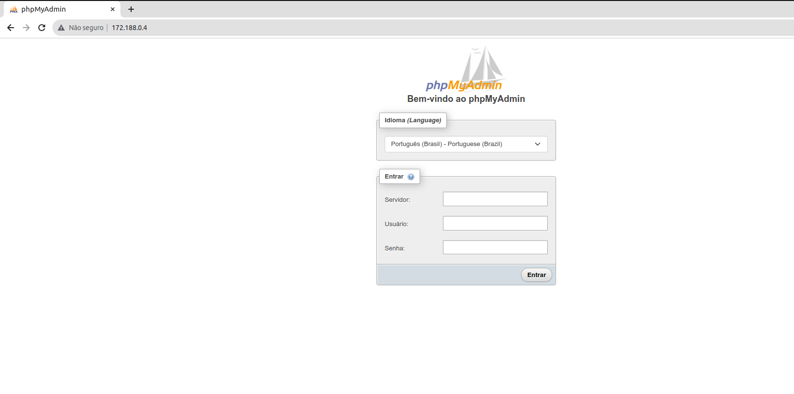

# Sistema de cadastro

Este sistema realiza o cadastramento de produtos no banco de dados por meio de uma API. O sistema permite aos usuários cadastrar um produto e suas variações, como tambem atualiza-lo, deleta-lo, e fazer buscas especificas ou exibir todos produtos cadastrados com suas variações.

## Inicio

Essas instruções permitirão que você obtenha uma cópia do projeto em operação na sua máquina local para fins de desenvolvimento e teste.

### Pré-requisitos 📝

Realize o download e a instalação desses programas:

- ##### Docker

> 

- ##### Insomnia
> 

-----------------

### Instalação ⬇️ / Inicialização ✅

 

##### 1. Download do projeto

Faça o download da ultima Tag, depois extraia o diretorio, e abra com um editor ou ide.

> 

 

##### 2. Abrir o projeto no terminal

Depois de aberto o projeto, abra o terminal dentro desse diretorio.

 

##### 3. Criar imagem do Dockerfile

No terminal e dentro do diretorio, insira esse comando para iniciar a construção da imagem base da API.

> docker build -t base_api:1.0 -f Dockerfile.yml .

* build = para construir a imagem
* base_api = nome da imagem
* :1.0 = versão dessa imagem
* -f = para passar o nome do arquivo
* o ponto final indica no diretorio local

Para verificar se construiu a imagem, insira no terminal:

> docker images

Retorna as imagens presentes no computado.

 

##### 4. Iniciar o projeto 🆙

O comando a seguir subira o docker compose, que contem o banco de dados MySQL, phpMyadmin, e a imagem base da API:

> docker-compose -f compose.yml up

Primeiramente realiza o download das imagens contidas no docker compose, logo depois sobe em sequencia o banco de dados, phpMyadmin e por ultimo a API que realiza coneção com o banco de dados, por isso de ser o ultimo container a subir.

❗️ Se ocorrer um erro na hora de subir o compose, e o container da API mostrar um erro no log, verifique o topico de erros. ❗️

 

##### 5. Inspecionar os containers 🔍
Para verificas os logs de cada container precisa inserir o seguinte comando:

> docker container logs 📦

Tem que subistituir 📦 pelo nome do container para ter acesso ao seu log.

##### * projeto-estagio_db_1 = container do banco de dados

##### * projeto-estagio_api_1 = container da API

 

##### 6. Vizualizar a API na web

Para acessar a API na web e poder realizar um teste, podemos entrar por este endereço:

> http://172.188.0.5:8000/docs

 

##### 7. Realizar CRUD pelo Insomnia

Dentro do insomnia, crie um novo projeto e adicione os metodos **GET**, **POST**, **PUT** e **DELETE**:

- **GET** = obter dados geral ou individual
- **POST** = criar dados 
- **PUT** = atualizar dados
- **DELETE** = remover dados

Em cada metodo adicione o endereço referente:

- **GET** = 
- **POST** = 
- **PUT** = 
- **DELETE** = 

 

##### 0. Acessar o phpMyadmin

Para realizar o acesso ao container do phpMyadmin temos que ultilizar o ip do container, insira esse ip no navegador:

> http://172.188.0.4/

Deve abrir uma tela assim:

- Servidor = 172.188.0.3 (ip do container do MySQL)
- Usuário = root
- Senha = mysql

No canto esquerdo terá o banco estagio, nele podera ver as tabelas **products** e **products_variants**, nelas contera todos os produtos registrado pela API.

 

##### 1. Acessar o phpMyadmin

-----------------

### ⚠️ Erros ⚠️