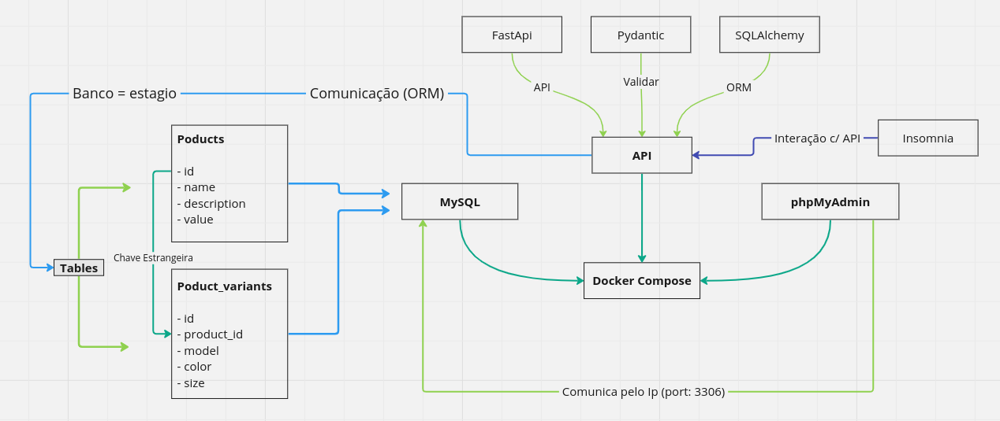
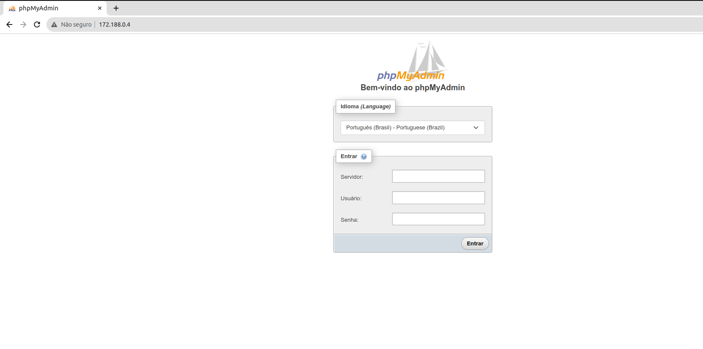
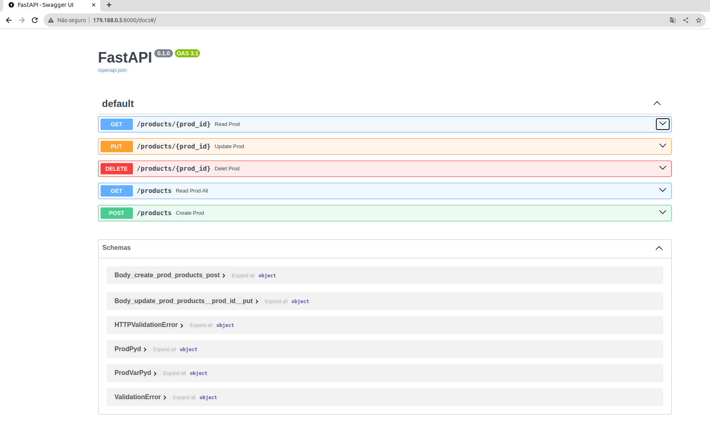
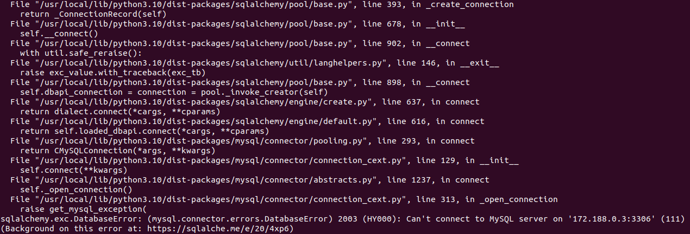
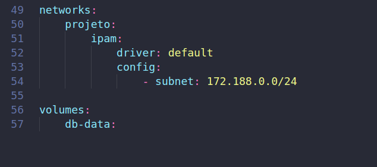
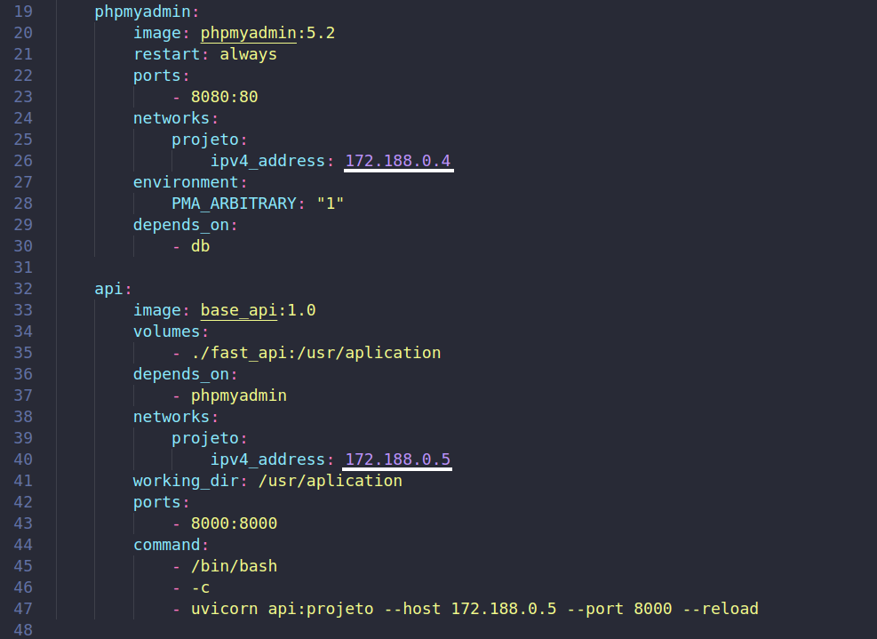
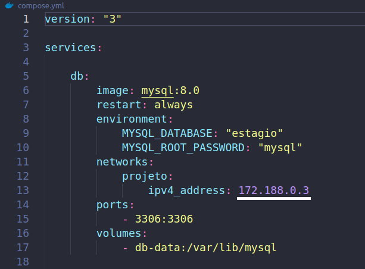
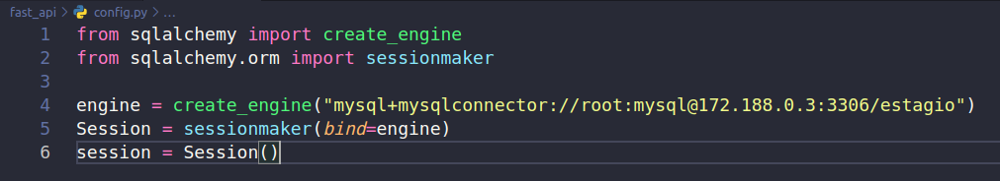

# Sistema de cadastro

Este sistema realiza o cadastramento de produtos no banco de dados por meio de uma API. O sistema permite aos usuários cadastrar um produto e suas variações, como também atualizá-lo, deletá-lo, e fazer buscas especificas ou exibir todos os produtos cadastrados com suas variações. 

**Representação do Projeto:**



### Inicio

Essas instruções permitirão que você obtenha uma cópia do projeto em operação na sua máquina local para fins de desenvolvimento e teste.

### Pré-requisitos 📝

Realize o download e a instalação dos programas necessários para inicializar este projeto:

- ##### Docker

> https://docs.docker.com/engine/install/

- ##### Insomnia
> https://insomnia.rest/download

-----------------

### Instalação ⬇️ / Inicialização ✅
<br>

#### 1. Download do projeto

Faça o download da última Tag do projeto, depois extraía, e abra com um editor ou ide de código de sua preferência.

> https://github.com/diogo-h-cost/Projeto-Estagio/tags

<br>

#### 2. Abrindo o projeto no terminal

Após aberto o projeto, abra o terminal dentro desse diretório.
<br>

#### 3. Criando imagem do Dockerfile

No terminal e dentro do diretório, insira esse comando para iniciar a construção da imagem base da API:

> docker build -t base_api:1.0 -f Dockerfile.yml .

* **build** = para construir a imagem
* **-t** = passar o nome da imagem
* **base_api** = nome da imagem
* **:1.0** = versão dessa imagem
* **-f** = passar o nome do arquivo
* **Dockerfile.yml** = nome do arquivo
* o **ponto** final indica o diretório local

Para verificar se construiu a imagem, insira no terminal:

> docker images

Retorna as imagens presentes no computador.
<br>

#### 4. Imagem Dockerfile

A imagem base da API é composta pelos seguintes elementos:

* Imagem base do **ubuntu:22.04** 
<p>

* Atualiza os pacotes >> **apt-get update**
<p>

* Instala o pacote de gerenciamento de repositórios >> **apt-get install -y software-properties-common**
<p>

* Adiciona o repositório de pacotes do Python >> **add-apt-repository ppa:deadsnakes/ppa -y**
<p>

* Atualiza os pacotes >> **apt-get update**
<p>

* Instala o Python 3.10 >> **apt-get install -y python3.10**
<p>

* Instala o pip (gerenciador de pacote Python) >> **apt-get install -y python3-pip**
<p>

* Instala através do pip >> **pip install fastapi uvicorn SQLAlchemy pydantic mysql-connector-python**
  * fastapi = Framework de criação de APIs;
  * uvicorn = Servidor para aplicações web;
  * SQLAlchemy = ORM para bancos de dados relacionais;
  * pydantic = Validador de dados;
  * mysql-connector-python = Conector para banco de dados MySQL.
<br>

#### 5. Iniciar o projeto 🆙

O comando a seguir subira o Docker compose, que contem o banco de dados MySQL, phpMyAdmin, e a imagem base da API:

> docker-compose -f compose.yml up

Primeiramente realiza o download das imagens contidas no Docker compose, logo depois sobe em sequência o banco de dados, phpMyAdmin e por último a API que realiza conexão com o banco de dados, por isso de ser o último contêiner a subir.

##### ❗️ Se ocorrer um erro na hora de subir o Docker compose, e o contêiner da API mostrar um erro no log, verifique o tópico **Erros ⚠️**.❗️
<br>

#### 6. Inspecionar os  contêineres 🔍
Para verificas os logs de cada contêiner precisa inserir o seguinte comando no terminal:

> docker container logs 📦

Tem que substituir 📦 pelo nome do contêiner para ter acesso ao seu log.

* **projetoestagio_db_1** = contêiner do **banco de dados**

* **projetoestagio_api_1** = contêiner da **API**

##### ❗️ Se ocorrer um erro na hora de acessar o log, verifique o tópico **Erros ⚠️**.❗️

<br>

#### 7. Acessar o phpMyAdmin

Para realizar o acesso ao phpMyAdmin temos que utilizar o IP do contêiner, insira esse endereço no navegador web:

> http://172.188.0.4/


Deve abrir a seguinte tela:



#### Acesso:

- **Servidor** = 172.188.0.3 (IP do contêiner do **MySQL**)
- **Usuário** = root
- **Senha** = mysql

No canto esquerdo terá o banco **estagio**, nele conterá as tabelas **products** e **products_variants**, nas tabelas conterá todos os produtos e suas variantes registrados pela API.
<br>

#### 8. Visualizar a API na web

Para acessar a API na web e poder realizar um teste, podemos acessar este endereço, que dará acesso às rotas contidas na API:

> http://172.188.0.5:8000/docs

<br>

Deve abrir a seguinte tela exibindo as rotas da API:
(Veja o tópico **8**, para saber o significado de cada rota).
<br>



❗️O IP da imagem foi alterado por conta do erro (verifique o tópico **Erros ⚠️**).❗️
<br>

#### 9. CRUD pelo Insomnia

Dentro do insomnia, crie um novo projeto e adicione os métodos **GET**, **POST**, **PUT** e **DELETE**:

- **GET** = obter dados geral ou individual
- **POST** = criar dados 
- **PUT** = atualizar dados
- **DELETE** = remover dados

Em cada método adicione o endereço referente:

- **GET ALL** = http://179.188.0.5:8000/products
(Traz todos os produtos e suas variantes)
<p>

- **GET** = http://179.188.0.5:8000/products/✖️
<p>

- **POST** = http://179.188.0.5:8000/products
<p>

- **PUT** = http://179.188.0.5:8000/products/✖️
<p>

- **DELETE** = http://179.188.0.5:8000/products/✖️


❗️ O símbolo ✖️ deve ser **substituído** pelo **número** do **produto**.

Nas rotas **POST** e **PUT** deve conter as informações do produto e sua variante.

As informações são validadas pelo **Pydantic** que é uma biblioteca Python para executar a validação de dados.
<br>

#### 10. Interação API com MySQL

A interação ocorre por meio do **ORM SQLAlchemy**, que utiliza o conector **mysqlconnector** que contem várias formas de manipular os dados contidos no banco de dados.

O conector é composto pelos seguintes elementos:

> create_engine("**mysql**+**mysqlconnector:**//**root**:**mysql**@**172.188.0.3**:**3306**/**estagio**")

* **mysql** = banco de dados utilizado;
<p>

* **mysqlconnector** = conector do banco de dados;
<p>

* **root** = usuario;
<p>

* **mysql** = senha;
<p>

* **172.188.0.3** = IP do contêiner do banco de dados;
<p>

* **3306** = porta padrão do MySQL;
<p>

* **estagio** = nome do banco de dados.
<br>

#### Tabelas

Foi utilizado comandos de SQL puro no script Python para criar as tabelas no banco de dados, os seguintes códigos de **SQL** cria as tabelas **products** e **products_variants**: 


* **products**

``` sql
CREATE TABLE IF NOT EXISTS products (
    id INT AUTO_INCREMENT PRIMARY KEY, 
    name VARCHAR(100) NOT NULL, 
    description VARCHAR(120) NOT NULL, 
    value FLOAT NOT NULL);
```

* **products_variants**

``` sql
CREATE TABLE IF NOT EXISTS products_variants (
    id INT AUTO_INCREMENT PRIMARY KEY,
    product_id INT, 
    model VARCHAR(40) NOT NULL, 
    color VARCHAR(20) NOT NULL,
    size VARCHAR(40) NOT NULL,
    FOREIGN KEY (product_id) REFERENCES products(id) ON DELETE CASCADE)
```

❗️Só será criada as tabelas de elas não existirem no banco de dados, por conta da condição ```IF NOT EXISTS``` que verifica internamente no banco de dados.
<br>

#### Entidades

As entidades representam as tabelas do banco de dados no script Python, cada entidade tem a seguinte linha para referenciala com a tabela no banco de dados:

```python
class Products(Base):
    __tablename__ = 'products'
```

Neste exemplo a class **Products** representa a tabela **products** no banco de dados, ela herda da class **Base** que está contida no **ORM SQLAlchemy**. 

As alterações realizadas nos atributos da class serão adicionadas, mas não serão salvas no banco de dados até que sejam comitadas, o exemplo a seguir apenas **adiciona** as alterações realizadas:

```sql
session.add(#)
```
(O simbolo **#** é a atualização realizada, uma variavel .....)

Agora nesta linha é **comitada** (salva) as alterações realizadas no banco de dados:

```sql
session.commit()
```

* #### session

Entendo os sessions do ORM SQLAlchemy:

```python
Session = sessionmaker(bind=engine)
session = Session()
```

**Session** é a criação de uma sessão vinculada e configurada a um motor especificado (bind = **motor**).

**session** é uma instância da classe **Session**. Essa instância representa uma sessão ativa que pode ser usada para interagir com o banco de dados.
<br>

#### 11. Parar o projeto ⛔️

Para parar o projeto e seus contêiner insira o seguinte código:

> **docker-compose -f compose.yml down**

Para deletar o volume do banco de dados após para o projeto use o comando:

> **docker volume rm projetoestagio_db-data**

❗️ Excluirá todas as informações contidas no banco de dados.
<br>

-----------------

## Erros ⚠️
<br>
 
### > Tópico 5️⃣
<br>


* #### Problema 🆘

**Erro ao subir o contêiner da API com o Docker compose.** ⬇️



A imagem acima mostra o log do contêiner da API não conseguindo se comunicar com o contêiner do banco de dados, isso ocorre por conta da faixa de IP especificada no Docker compose que já está sendo utilizada.

* #### Solução ✅

Temos que alterar a **Subnet** para uma faixa que não está em uso:

##### Docker compose: ⬇️

<br>

Logo após temos que alterar os IPs dos contêineres, lembrando de passar o IP da API para o **uvicorn**:

##### Contêineres no Docker compose: ⬇️

<br>

E não se esquecer de passar o IP do contêiner do MySQL para o conector do SQLAlchemy:

##### contêiner MySQL no Docker compose: ⬇️

<br>

##### Conector do ORM SQLAlchemy: ⬇️


**Engine** configurado com as informações do contêiner do MySQL, o **banco de dados**, **conector**, nome do **usuário**, **senha** do usuário, **IP do contêiner** do MySQL, a **porta** de conexão e o **nome do banco de dados**.

<br>


### > Tópico 6️⃣
<br>

* #### Problema 🆘

**Erro ao verificar o log do contêiner.**

Quando verificar o log do contêiner pode ocorrer de não verificar:

> ➡️ docker container logs projeto-estagio_db_1
> Error response from daemon: No such container: projeto-estagio_db_1

* #### Solução ✅

Basta apenas remover o sinal ``` - ```, segue o exemplo:

> ➡️ docker container logs projetoestagio_db_1
> 2023-12-12 17:07:31+00:00 [Note] [Entrypoint]: Entrypoint script for MySQL Server 8.0.35-1.el8 started.
.......

Dessa forma estará resolvido o acesso ao log do contêiner (se aplica para **todos** os contêineres).

-----------------

### Futuras atualizações 🗓

* Cadastrar mais variações em um produto;
<p>

* Adicionar validador:
  * Rota **GET** = verificar se o **prod_id** existe, caso não existir enviar uma mensagem de aviso;
  * Rota **PUT** = verificar se o **prod_id** existe, caso não existir enviar uma mensagem de aviso;
  * Rota **DELETE** = verificar se o **prod_id** existe, caso não existir enviar uma mensagem de aviso.

-----------------

### Autor ✒️

* #### **Diogo Lima**